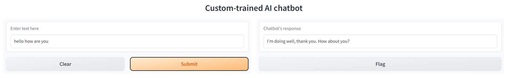
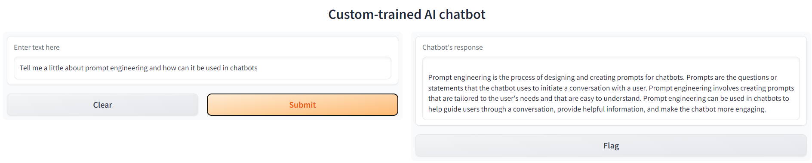

# Custom_knowledge_trained_chatgpt

I am using in-context learning in order to train chatgpt on custom data that can be anything related to your organization or any text data in general
I used gpt-3.5-turbo model which is the same model chatgpt is trained on
Since openai have released a limited amount of tokens so the response will not be the same as chatgpt but it will be more than enough.

# To train it on your data:
* Get an api key from openai api site and replace your_api_key with that token
* Add all data in form of txt extension in textdata folder. You can add any number of files and can also paste codes in txt files.
* Run train.py and it will generate an index.json file
* The model then uses this index file along with its previous knowledge to generate response

## execute test.py to run it in terminal
This is a sample interface ,it can be modified according to your needs

  
  

## Main.py is used to run the model on local host

## Scopes of use:
* You can easily create a question and answer bot
* It can be trained on any novel or book and then using prompt engineering it can behave like any character from that book
* With help of prompt engineering you can use for any purpose you want

Sources/inspirations:

https://beebom.com/how-train-ai-chatbot-custom-knowledge-base-chatgpt-api/ (For UI)
https://www.youtube.com/watch?v=EE1Y2enHrcU
https://blog.devgenius.io/creating-a-chatgpt-based-chatbot-using-in-context-learning-method-17c30ba72f3 (to know more about in-context learning)
